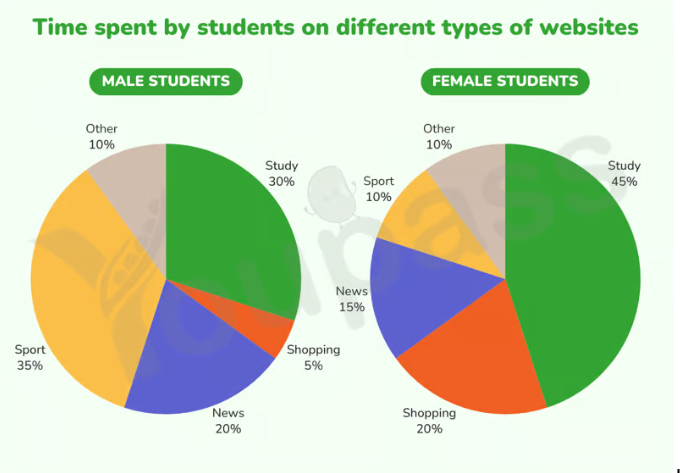

# 📝 Writing Task 1 — Chấm & Sửa Bài

> **Ngày:** 21/09/2026
> **Dạng bài:** Static Chart — **Two Pie Charts** (so sánh 2 nhóm đối tượng)
> **Chủ đề:** Percentage of time students spend on different website types
> **Guide tham chiếu:** [`IELTS-Writing-Task1-StaticChart-Guide.md`](../IELTS-Writing-Task1-StaticChart-Guide.md)
> **Độ dài bài viết:** 205 từ ✅ (yêu cầu ≥150)

---

## 📋 ĐỀ BÀI

> The charts below illustrate the **percentage of time** that male and female students **spend on** five different types of websites.
>
> Summarise the information by selecting and reporting the main features, and make comparisons where relevant.



### Dữ liệu trong biểu đồ

| Website category | Male students | Female students | Chênh lệch |
|---|---:|---:|---|
| **Study** | 30% | **45%** 🔺 | Nữ +15 pp |
| **Sport** | **35%** 🔺 | 10% | Nam gấp 3,5 lần |
| **News** | 20% | 15% | Nam +5 pp |
| **Shopping** | 5% 🔻 | 20% | Nữ gấp 4 lần |
| **Other** | 10% 🔻 | 10% 🔻 | Bằng nhau |

🔺 = cao nhất trong nhóm 🔻 = thấp nhất trong nhóm

---

## ✍️ BÀI VIẾT CỦA TÔI (bản gốc)

> The two pie charts illustrate how male and female students spend on five website categories. Overall, girl students using study websites had the largest share among all other kinds of websites, while sports was recorded the most popular website category in male respondents. Notably, the percentage of individuals using other websites in male and female students was the same rate.
>
> Regarding the allocation of male students in varied websites, sports was the most prevalent, with just more than one-third of all male learners. This was followed by study websites, which accounted for 30% of the total. The percentage of respondents spending on news websites allocated 20%, which was twice as high as that of other websites (10%) in the same surveyed timeframe.The lowest figure was shopping websites making up 5% in the total of all website categories.
>
> In terms of female students chart, just under half (45%) of all students spent on study websites, the highest proportion in this chart. The second rank was shopping websites, which was significantly lower than that of study websites, which made up 20% of female learners. News followed with 15% of students, while both sport and others websites - each constituted  10%, combining to represent 20% in the total.

---

# 📊 PHẦN 1 — ĐIỂM SỐ THEO BAND DESCRIPTORS

| Tiêu chí | Band | Lý do chính |
|---|:---:|---|
| **Task Achievement** | **6.0** | Có overview rõ, số liệu **chính xác 100%**, phủ hết 10 slice. Nhưng: hiểu sai **đơn vị đo** (% *thời gian* → viết thành % *sinh viên*), bịa thông tin ("surveyed timeframe"), và **gần như không so sánh 2 chart** dù đề yêu cầu "make comparisons where relevant". |
| **Coherence & Cohesion** | **6.0** | Chia đoạn chuẩn, linker tốt (*Regarding, In terms of, This was followed by, Notably*). Nhưng chuỗi "which… which…" gây mơ hồ; body tổ chức theo từng chart rời rạc, không có cầu nối so sánh. |
| **Lexical Resource** | **6.0** | Có nỗ lực dùng pie vocabulary đúng hướng (*accounted for, made up, constituted, just under half, twice as high as*). Nhưng lỗi collocation **"spend on websites"** lặp 3 lần, "girl students" sai register, "varied", "the same rate" thừa. |
| **Grammatical Range & Accuracy** | **5.5** | Vài câu **vỡ cấu trúc** ("The percentage of respondents spending on news websites allocated 20%"), lẫn thì hiện tại/quá khứ, thiếu mạo từ, thiếu dấu cách sau dấu chấm. |

> ## 🎯 **OVERALL: BAND 6.0**
>
> Độ dài 205 từ ✅ | Số liệu đúng hết ✅ | Có overview ✅
> **Trần điểm hiện tại bị kéo xuống bởi GRA và việc thiếu comparison.**

---

# 🔍 PHẦN 2 — SỬA BÀI CHI TIẾT (Line by line)

## 🟥 LỖI NGHIÊM TRỌNG NHẤT — Đọc sai đơn vị của biểu đồ

Đề bài: *"the **percentage of time** that male and female students **spend on** five different types of websites"*

Biểu đồ đo **% THỜI GIAN**, không phải **% SINH VIÊN**. Sai ở **4 chỗ**:

| Đã viết | Vấn đề |
|---|---|
| "one-third of all male **learners**" | ❌ 35% là *thời gian*, không phải 35% số nam sinh |
| "20% **of female learners**" | ❌ sai đơn vị |
| "15% **of students**" | ❌ sai đơn vị |
| "45% **of all students** spent on study websites" | ❌ sai đơn vị |

✅ **Cách sửa:** dùng *of the total time / of their online time / of the total* — hoặc bỏ hẳn phần "of…":

> "sport websites accounted for just over one third **of their online time**"
> "study websites made up 45% **of the total**"

**➡️ Đây là lỗi kéo TA từ 7.0 xuống 6.0. Sửa được lỗi này là thay đổi lớn nhất.**

---

## 📝 INTRODUCTION

> ❌ *The two pie charts illustrate how male and female students **spend on** five website categories.*

| # | Lỗi | Sửa |
|:---:|---|---|
| 1 | `spend on` — thiếu tân ngữ. Động từ `spend` bắt buộc có object: *spend **time/money** on sth* | `spend their time on` |
| 2 | Thiếu paraphrase chữ **"percentage of time"** — phần cốt lõi của đề | thêm `the proportion of time` |
| 3 | Thì hiện tại `spend` ở intro nhưng quá khứ `was/spent` ở body → **không nhất quán** | Chọn 1: chart không có mốc thời gian → dùng **hiện tại** hoặc **quá khứ**, nhưng phải xuyên suốt |

✅ **Sửa:**
> The two pie charts compare **the proportion of time** that male and female students **devoted to** five different types of website.

---

## 📝 OVERVIEW

> ❌ *Overall, **girl students** using study websites had the largest share among **all other** kinds of websites, while **sports was recorded** the most popular website category **in** male respondents. Notably, **the percentage** of individuals using other websites in male and female students was **the same rate**.*

| # | Lỗi | Loại | Sửa |
|:---:|---|---|---|
| 4 | `girl students` | **Register** — quá thân mật trong văn học thuật | `female students` |
| 5 | `girl students using study websites had the largest share` | **Cấu trúc** — chủ ngữ là *sinh viên*, nhưng thứ "có largest share" lại là *website* | `study websites accounted for the largest share **among** female students` |
| 6 | `among all other kinds of websites` | **Thừa từ** (redundancy) | bỏ, hoặc `of all five categories` |
| 7 | `sports was recorded the most popular` | **Grammar** — thiếu `as` sau `recorded` | `was recorded **as** the most popular` hoặc đơn giản `was the most popular` |
| 8 | `sports` | **Chính xác** — biểu đồ ghi **Sport** (số ít) | `sport` (thống nhất cả bài) |
| 9 | `in male respondents` | **Preposition** | `among male respondents` |
| 10 | `the percentage … was the same rate` | **Thừa nghĩa** — *percentage* = *rate*, lặp ý | `identical proportions` / `an equal share` |
| 11 | **Thiếu category THẤP NHẤT** | **TA** — Guide mục 12: overview static = *highest **+ lowest*** | thêm: shopping thấp nhất ở nam (5%), sport & other thấp nhất ở nữ (10%) |

✅ **Sửa:**
> Overall, study websites took up the largest share of female students' time, whereas sport was the dominant category among males. It is also notable that shopping attracted the smallest proportion among male students, while sport and other websites were the least visited by females.

---

## 📝 BODY 1 (Male)

> ❌ *Regarding **the allocation of male students in varied websites**, sports was the most prevalent, with **just more than** one-third of all male **learners**. This was followed by study websites, which accounted for 30% of the total. **The percentage of respondents spending on news websites allocated 20%**, which was twice as high as that of other websites (10%) **in the same surveyed timeframe**.**T**he lowest **figure was shopping websites** making up 5% **in the total of** all website categories.*

| # | Lỗi | Loại | Sửa |
|:---:|---|---|---|
| 12 | `the allocation of male students in varied websites` | **Wordy + sai từ**. `varied` = "đa dạng/phong phú", ở đây cần `various` | `Regarding male students,` (ngắn gọn là đủ) |
| 13 | `just more than` | **Collocation** | `just over` ✅ (đây là cụm chuẩn) |
| 14 | `one-third of all male learners` | **Sai đơn vị** (xem lỗi 🟥) | `just over one third of their online time` |
| 15 | 🔴 `The percentage of respondents spending on news websites allocated 20%` | **VỠ CÂU** — chủ ngữ "The percentage" không thể "allocate" cái gì. Đây là lỗi GRA nặng nhất bài | `News websites **accounted for** 20%` |
| 16 | `in the same surveyed timeframe` | **TA — bịa thông tin**. Đề không hề cho mốc thời gian nào | **Xoá hẳn** |
| 17 | `timeframe.The` | **Punctuation** — thiếu dấu cách | `timeframe. The` |
| 18 | `The lowest figure was shopping websites` | **Mismatch** — "figure" (con số) ≠ "websites" (trang web) | `The smallest proportion went to shopping websites, at just 5%.` |
| 19 | `in the total of all website categories` | **Wordy** | `of the total` |

✅ **Điểm CỘNG:** `which was twice as high as that of other websites (10%)` — **rất tốt!** Dùng đúng `that of` để tránh lặp + comparison structure band 7. Giữ nguyên.

✅ **Sửa:**
> Regarding male students, sport websites accounted for the greatest share, at just over one third (35%). Study sites followed closely with 30%, while news made up a fifth of the total — exactly twice the figure recorded for other websites (10%). The smallest allocation went to shopping, at a mere 5%.

---

## 📝 BODY 2 (Female)

> ❌ *In terms of **female students chart**, just under half (45%) of all **students spent on** study websites, the highest proportion in this chart. **The second rank was** shopping websites, **which** was significantly lower than that of study websites, **which** made up 20% of female learners. News followed with 15% **of students**, while **both** sport and **others websites - each** constituted␣␣10%, **combining to represent** 20% in the total.*

| # | Lỗi | Loại | Sửa |
|:---:|---|---|---|
| 20 | `female students chart` | **Article/possessive** thiếu | `the female students' chart` → tốt hơn: `As for female students,` |
| 21 | `students spent on study websites` | **Collocation** thiếu object | `spent **their time** on` hoặc đổi chủ ngữ: `was devoted to study websites` |
| 22 | `The second rank was shopping websites` | **Awkward** | `Shopping websites **ranked second**` |
| 23 | 🔴 `which was significantly lower…, which made up 20%` | **Mơ hồ nghiêm trọng** — hai mệnh đề `which` liên tiếp; `which` thứ 2 bám vào *study websites*, khiến người đọc hiểu **study = 20%** (sai!) | Tách câu: `Shopping websites ranked second at 20%, well below the figure for study sites.` |
| 24 | `15% of students` | **Sai đơn vị** | `15% of the total` |
| 25 | `both … each` | **Thừa** — dùng 1 trong 2 | `sport and other websites each constituted 10%` |
| 26 | `others websites` | **Grammar** — `other` là tính từ, không có `-s` | `other websites` |
| 27 | `websites - each` | **Punctuation** — hyphen (-) dùng sai chỗ; cần dấu phẩy hoặc em dash (—) | `websites, each…` |
| 28 | `constituted␣␣10%` | **Typo** — hai dấu cách | `constituted 10%` |
| 29 | `combining to represent 20% in the total` | **Thông tin vô nghĩa** — cộng 2 slice nhỏ lại thành 20% không mang ý nghĩa gì | Thay bằng **so sánh với nam** (có giá trị hơn nhiều) |

---

## 🟧 LỖI CẤU TRÚC LỚN — Thiếu SO SÁNH giữa 2 chart

Đề yêu cầu: *"make comparisons **where relevant**"*. Trong 205 từ, chỉ so sánh **đúng 1 lần** (câu "other websites… the same rate" ở overview). Body 1 và Body 2 là hai bài mô tả **hoàn toàn tách rời**.

Đây chính xác là **Lỗi 6** trong guide (mục 16): *"Không so sánh giữa các slice."*

**Những so sánh "vàng" đã bỏ lỡ:**

| Category | Male | Female | Câu so sánh nên viết |
|---|---:|---:|---|
| **Shopping** | 5% | 20% | *"four times the male figure"* — chênh lệch lớn nhất bài! |
| **Sport** | 35% | 10% | *"only a third of that recorded for males"* |
| **Study** | 30% | 45% | *"15 percentage points higher than their male counterparts"* |
| **Other** | 10% | 10% | *"identical in both groups"* ✅ (đã bắt được — tốt) |

**➡️ Chỉ cần chèn 3 cụm so sánh vào Body 2 là TA lên 7.0 ngay.**

---

# ✍️ PHẦN 3 — HAI BẢN VIẾT LẠI

## 🅰️ Bản A — Giữ nguyên cấu trúc bài gốc, chỉ sửa lỗi (≈ Band 6.5)

> The two pie charts compare the proportion of time that male and female students devoted to five different types of website.
>
> Overall, study websites took up the largest share among female students, whereas sport was the most popular category for males. Notably, an identical proportion of time was spent on other websites by both groups, while shopping was the least visited category among male students.
>
> Regarding male students, sport websites were the most prevalent, accounting for just over one third of their online time. This was followed by study websites, which made up 30% of the total. News websites accounted for 20%, exactly twice the figure recorded for other websites (10%). The smallest proportion went to shopping, at a mere 5%.
>
> As for female students, just under half of the total time (45%) was devoted to study websites, the highest proportion in this chart. Shopping websites ranked second at 20%, four times the equivalent male figure, followed by news at 15%. Sport and other websites each constituted 10%, meaning that females spent only a third as much time on sport as their male counterparts.

*(183 từ — mọi ý của bài gốc được giữ, chỉ sửa ngữ pháp + thêm 2 so sánh)*

---

## 🅱️ Bản B — Model answer Band 7.5 (cấu trúc so sánh)

> The two pie charts compare the proportion of online time that male and female students devoted to five categories of website.
>
> Overall, study websites dominated female students' online time, while males spent the largest share on sport. The most striking contrast lay in shopping and sport, where the two genders showed almost opposite patterns, whereas other websites attracted an identical share from both.
>
> Turning to the male chart, sport websites took the greatest proportion, at just over one third (35%). This was closely followed by study sites at 30%, while news made up a fifth of the total — precisely double the figure for other websites (10%). Shopping received the smallest allocation, at a mere 5%.
>
> Among female students, by contrast, nearly half of all online time (45%) went to study websites, fifteen percentage points above the male equivalent. Shopping ranked second at 20%, four times the proportion recorded for males, and was trailed by news at 15%. Sport and other websites each constituted 10%; while the latter was identical across both groups, the time females devoted to sport was less than a third of the male figure.

*(187 từ)*

### 🔑 Bản B hơn bản A ở đâu?

- **Overview** nêu được *pattern* ("almost opposite patterns") chứ không chỉ liệt kê cao/thấp
- **Mỗi câu ở Body 2 đều có comparison** gắn với Body 1
- Ngôn ngữ nâng cấp: `dominated`, `the most striking contrast lay in`, `was trailed by`, `the latter`, `fifteen percentage points above`
- `precisely double` thay cho `twice as high as` — tránh lặp cấu trúc
- Dùng dấu `;` và em dash `—` → punctuation range (tính điểm GRA)

---

# 🪜 PHẦN 4 — LỘ TRÌNH CẢI THIỆN STEP BY STEP

## ⚡ Bước 1 (làm NGAY, +0.5 band) — Sửa 3 lỗi "chết người"

Trước khi viết bài tiếp theo, ghi 3 dòng này ra giấy dán màn hình:

```
1. ĐỌC KỸ ĐƠN VỊ TRONG ĐỀ: % of TIME? % of PEOPLE? amount of MONEY?
   → Viết sai đơn vị = mất 1 band TA.

2. spend + TIME/MONEY + on + sth   (KHÔNG BAO GIỜ "spend on sth")
   → An toàn hơn: dùng "devote/allocate X% to sth" hoặc "X accounted for Y%"

3. KHÔNG BỊA dữ liệu ngoài biểu đồ
   → Không có năm thì đừng viết "timeframe", "period", "survey year"
```

## 🔧 Bước 2 — Chữa bệnh "vỡ câu" (GRA 5.5 → 6.5)

Câu hỏng trong bài: *"The percentage of respondents spending on news websites allocated 20%"*

**Nguyên nhân:** nhồi quá nhiều thành phần vào 1 chủ ngữ. Cách chữa — dùng **3 khuôn mẫu cố định**, mỗi câu chọn 1, không trộn:

```
Mẫu 1 (CHỦ NGỮ = WEBSITE):   News websites accounted for 20% of the total.
Mẫu 2 (CHỦ NGỮ = NGƯỜI):     Male students devoted 20% of their time to news websites.
Mẫu 3 (BỊ ĐỘNG):             20% of the total was allocated to news websites.
```

> **Bài tập:** Lấy 10 slice trong biểu đồ này, viết lại mỗi slice **3 lần** theo 3 mẫu trên → 30 câu. Làm xong sẽ không bao giờ vỡ câu nữa.

## 🔗 Bước 3 — Chữa bệnh "which… which…" (CC 6.0 → 6.5)

**Quy tắc cứng: MỖI CÂU CHỈ ĐƯỢC 1 CHỮ `which`.**

Muốn nối ý thứ hai, dùng 3 cách thay thế (đều "sang" hơn `which`):

| Cách | Ví dụ |
|---|---|
| **Appositive** (cụm danh từ, không cần `which`) | Shopping ranked second at 20%, **four times the male figure**. |
| **V-ing** | Sport and other websites each constituted 10%, **together accounting for** a fifth. |
| **Tách câu + the latter/the former** | …at 35% and 10%. **The latter** was identical for both genders. |

## 📐 Bước 4 — Đổi cấu trúc body sang so sánh (TA 6.0 → 7.0)

Từ bài sau, với **2 pie chart so sánh 2 nhóm**, áp dụng khuôn này:

```
Body 1: Mô tả ĐẦY ĐỦ nhóm 1 (không so sánh) — 4 câu
Body 2: Mô tả nhóm 2, NHƯNG mỗi câu phải có 1 mệnh đề so sánh ngược về nhóm 1
        → "…, four times the male figure"
        → "…, fifteen percentage points above the male equivalent"
        → "…, less than a third of the male figure"
        → "…, identical to that of their male counterparts"
```

**Học thuộc 6 cụm so sánh này** (dùng được cho mọi đề Task 1):

```
X times the figure for…      |  … percentage points higher/lower than…
only half/a third of…        |  identical to / on a par with…
well above/below…            |  the male/female equivalent
```

## 🎨 Bước 5 — Nâng Lexical Resource (LR 6.0 → 6.5)

Đã dùng tốt: `accounted for, made up, constituted, just under half, twice as high as, prevalent`. **Giữ nguyên!** Bổ sung **6 cụm** để không lặp:

| Thay vì lặp | Dùng thêm |
|---|---|
| `accounted for` (dùng 2 lần trong bài) | `took up`, `went to`, `was devoted to`, `dominated` |
| `the highest proportion` | `the greatest share`, `the lion's share`, `topped the chart` |
| `the lowest` | `a mere 5%`, `the smallest allocation`, `barely one twentieth` |

⚠️ **Đồng thời XOÁ khỏi vốn từ:** `girl students`, `varied websites`, `the same rate`, `in the total of`.

---

## 📈 Dự phóng điểm

| Hoàn thành | Band dự kiến |
|---|:---:|
| Hiện tại | **6.0** |
| + Bước 1 & 2 (đơn vị + hết vỡ câu) | **6.5** |
| + Bước 3 & 4 (referencing + comparison) | **7.0** |
| + Bước 5 (lexis) và duy trì ổn định | **7.0–7.5** |

**Ưu tiên tuyệt đối:** Bước 1 và Bước 2.
Bài viết **không yếu về ý tưởng hay số liệu** (đọc chart chính xác 10/10 slice — rất tốt), mà yếu ở **độ chính xác câu**. Đó là thứ sửa được nhanh nhất bằng luyện khuôn mẫu.

---

## ✅ CHECKLIST TỰ KIỂM TRA CHO BÀI TASK 1 TIẾP THEO

- [ ] Đã xác định đúng **đơn vị** của biểu đồ (% time / % people / money / number)?
- [ ] Intro đã **paraphrase** đủ 3 yếu tố (loại chart + chủ đề + đơn vị)?
- [ ] Overview có đủ **cao nhất + thấp nhất + 1 pattern nổi bật**? Không có trend language?
- [ ] Mỗi câu chỉ có **tối đa 1 chữ `which`**?
- [ ] Body 2 có ít nhất **3 mệnh đề so sánh** ngược về Body 1?
- [ ] Không có từ nào **bịa ra ngoài biểu đồ** (năm, timeframe, lý do)?
- [ ] Thì được dùng **nhất quán** từ đầu đến cuối?
- [ ] Đã đọc lại soát **dấu cách, dấu chấm, số nhiều**?
- [ ] Độ dài **160–200 từ**?
